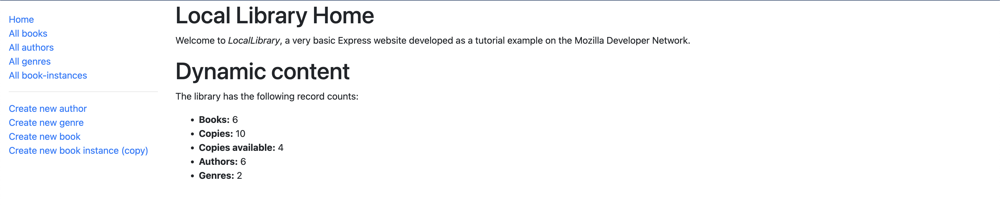
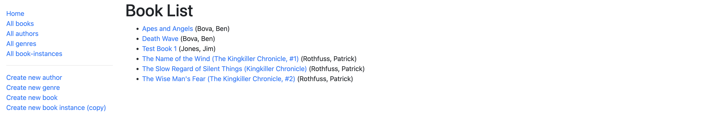
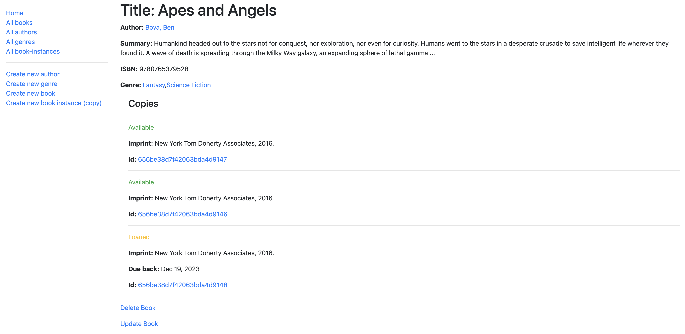
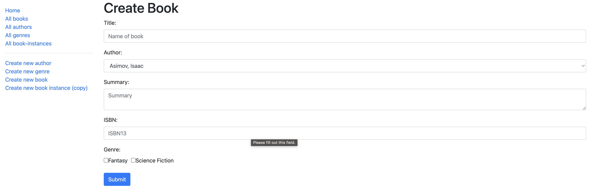
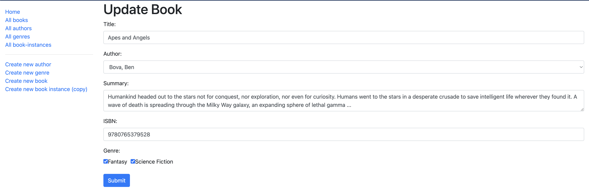

# Local Library

## Previews

Home:

List of all books:

Detail page of a book:

Create a new book:

Delete a book:

Update a book:

## Description

Looking for a new system to manage inventory for the local library? Look no further! This app was developed with the help of the Mozilla Developer Network to learn more about developing applications using Express. All users can create, read, update and delete objects from the database. The objects include: authors, books, book instances (copies) and genres.

This project highlights:

- Node.js
- Express
- Server-side routing
- MVC architecture
- CRUD operations
- MongoDB/Mongoose
